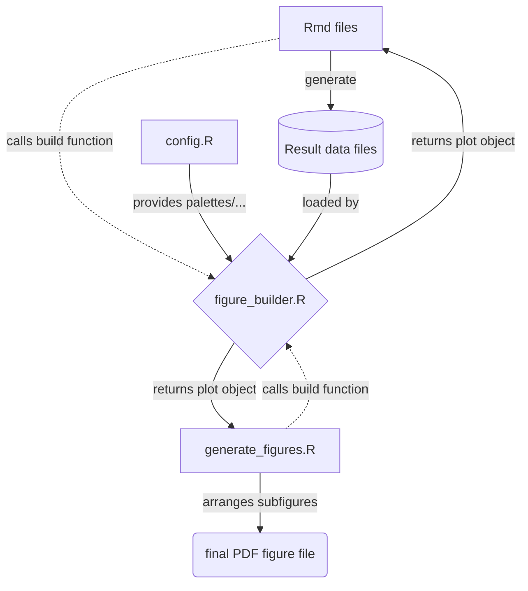

# Human and murine neutrophils share core transcriptional programs in both homeostatic and inflamed contexts

This repository contains the code accompanying the manuscript "Human and murine neutrophils share core transcriptional programs in both homeostatic and inflamed contexts". Raw data to reproduce analyses in this repository can be obtained as detailed in the reporting summary.

## Software requirements

Below is a table summarizing important software requirements that are needed to generate the analyses and figures discussed in our manuscript. All analyses except for alignment of raw fastq files were run on an M1 MacBook Pro (13-inch, M1, 2020; MacOS 12.5.1). Our code has been run and tested on the aforementioned infrastructure, no non-standard hardware is required to execute the code.

|Software|Version|
|--------|-------|
R|4.2.0
Bioconductor|3.15
magick|2.7.3
DESeq2|1.36.0
ggvenn|0.1.9
circlize|0.4.15
ggsci|2.9
RColorBrewer|1.1-3
viridis|0.6.2
viridisLite|0.4.0
MASS|7.3-57
rstatix|0.7.0
ggbreak|0.0.9
reshape2|1.1.4
kSamples|1.2-9
SuppDists|1.1-9.7
gridExtra|2.3
ggrastr|1.0.1
ggtext|0.1.1
EnhancedVolcano|1.14.0
ComplexHeatmap|2.12.0
ggrepel|0.9.1
ggpubr|0.4.0
edgeR|3.38.1
limma|3.52.1
SummarizedExperiment|1.26.1
Biobase|2.56.0
GenomicRanges|1.48.0
GenomeInfoDb|1.32.2
IRanges|2.30.0
S4Vectors|0.34.0
BiocGenerics|0.42.0
MatrixGenerics|1.8.0
matrixStats|0.62.0
biomaRt|2.52.0
BiocManager|1.30.18
zeallot|0.1.0
magrittr|2.0.3
forcats|0.5.1
stringr|1.4.0
dplyr|1.0.9
purrr|0.3.4
readr|2.1.2
tidyr|1.2.0
tibble|3.1.7
ggplot2|3.3.5
tidyverse|1.3.1
org.Hs.eg.db|3.15.0
TxDb.Hsapiens.UCSC.hg38.knownGene|3.15.0
GenomicFeatures|1.48.3
AnnotationDbi|1.58.0
goseq|1.48.0
geneLenDataBase|1.32.0
BiasedUrn|1.07
vsn|3.64.0
survcomp|1.46.0
prodlim|2019.11.13
Matrix|1.4-1
qvalue|2.28.0
apeglm|1.18.0
qusage|2.30.0
fgsea|1.22.0
msigdbr|7.5.1
sva|3.44.0
BiocParallel|1.30.2
genefilter|1.78.0
mgcv|1.8-40
nlme|3.1-157
GEOquery|2.64.2
rhdf5|2.40.0
jsonlite|1.8.0
httr|1.4.3
readxl|1.4.0
gridtext|0.1.4
writexl|1.4.0
cowplot|1.1.1
lme4|1.1-29
DoRothEA|1.8.0
decoupleR|2.2.2
CATLYST|1.16.2
matplotlib|3.5.1
python|3.9.1
HOMER|v4.11
marge|v0.0.4.9999
RVAideMemoire|0.9-81-2

## Installation guide

Clone this repository ,e.g., by running `git clone https://github.com/rgb-lab/inflamed_neutrophil_transcriptome.git`. Running this command will take below one minute on most current hardware and internet connections.

## Demo/instructions

To start reproducing the analyses, replace the `data/raw_data/` folder with the raw data folder that can be downloaded from a separate repository (please refer to reporting summary). After replacing that folder, you can start executing the included scripts.

All relevant scripts to generate results and figures discussed in the manuscript can be found in the `scripts/` folder. The suggested order to run the steps of the analysis is as following. Within each folder, .Rmd files are numbered according to the suggested/required run order.

1. `scripts/haemopedia/*`
2. `scripts/inflammatory_meta/*`
3. `scripts/zymosan/*`
4. `scripts/experimental_validation/*`
5. `generate_figures.R` (depends on the data generated by aforementioned steps)

A majority of the analyses can be run within 1–2 hours on hardware similar to ours.

## Structure of this repository

    .
    ├── data                                 # Contains all data needed for the analysis.
    │   ├── metadata                            # metadata, part of this repo
    │   ├── processed                           # generated, content not part of vcs
    │   └── raw_data                            # downloaded, content not part of vcs
    ├── figures                              # Container for generated figures.
    ├── scripts                              # Contains all scripts and utils required.
    │   ├── experimental_validation             # code relating to the validation experiments
    │   ├── generate_figures.R                  # the script that can be run to generate the manuscript's figures
    │   ├── haemopedia                          # code pertaining the haemopedia analysis
    │   ├── inflammatory_meta                   # code to analyze the inflammatory dataset
    │   ├── utils                               # various utils for data retrieval, plotting, ...
    │   └── zymosan                             # zymosan analysis scripts
    ├── README.md
    ├── inflammatory_metaanlysis.Rproj
    └── .gitignore

## Figures

Summary diagram of the figure generation mechanism.

