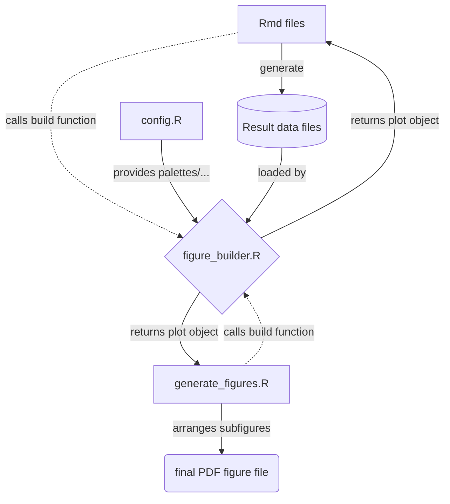

# A cross species map of neutrophil inflammatory responses

## Structure of this repository

    .
    ├── data                                 # Contains all data needed for the analysis.
    │   ├── metadata                            # metadata, part of this repo
    │   ├── processed                           # generated, content not part of vcs
    │   └── raw_data                            # downloaded, content not part of vcs
    ├── figures                              # Container for generated figures.
    ├── scripts                              # Contains all scripts and utils required.
    │   ├── experimental_validation             # code relating to the validation experiments
    │   ├── generate_figures.R                  # the script that can be run to generate the manuscript's figures
    │   ├── haemopedia                          # code pertaining the haemopedia analysis
    │   ├── inflammatory_meta                   # code to analyze the inflammatory dataset
    │   ├── utils                               # various utils for data retrieval, plotting, ...
    │   └── zymosan                             # zymosan analysis scripts
    ├── README.md
    ├── inflammatory_metaanlysis.Rproj
    └── .gitignore

## Figures

This is how figure generation works:

